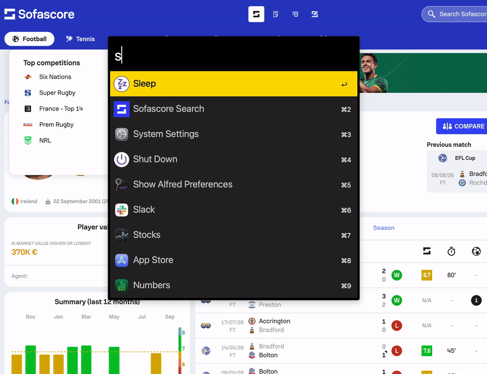

# Sofascore Search for Alfred

Search Sofascore for teams, players, leagues, and matches from Alfred — without relying on the old `/search?q=` URL (Sofascore’s site no longer supports that).

**Download:** [Latest release](https://github.com/robgill/alfred-sofascore/releases/latest) (grab the `.alfredworkflow` file and double-click to install)

## Setup

Two tiny chores, then you’ll be up and searching:

1. **Let Alfred talk to your browser.** Turn on **Allow JavaScript from Apple Events**. If you don't know how to do this, hit ↩ on your first search and it will direct you to some instructions, or Google it if you prefer!

2. **Sofascore needs to be open in a background tab.** Be aware your first search will open the website in the background if you don't already have it open. This shouldn't interrupt your flow, but just be mindful of what is going on.

That’s it. No API keys, no accounts. I hope this is useful. If so, consider following me on [X](https://x.com/rob_gill_) — I never post on there, but if you want to get in touch to let me know your thoughts, please do. ;)

> **Note:** Search currently uses **Google Chrome** (Apple Events → JavaScript in a Sofascore tab). Safari/Edge support isn’t in yet.

## Usage

Keyword: `sofa` (changeable in Workflow Configuration)

* <kbd>↩</kbd> Open the result on Sofascore
* <kbd>⇥</kbd> Drill into a team’s squad, or a league’s clubs
* <kbd>⌘</kbd><kbd>↩</kbd> Same as Tab (squad / clubs)

After Tab on a team, type to filter players (for example `ma` for Marcus Rashford). After Tab on a league, type to filter clubs (for example `man` for Manchester City and Manchester United).

Tabbing into a team or league also saves it to recents. Type the keyword alone (with a trailing space) to browse the last 20 results.

## Requirements

- [Alfred](https://www.alfredapp.com/) with Powerpack
- macOS
- Google Chrome with **Allow JavaScript from Apple Events** enabled
- System `python3` (no pip/brew packages)

## Privacy

Recents and caches live only on your Mac, in Alfred’s Workflow Data folder for this workflow (`~/Library/Application Support/Alfred/Workflow Data/com.robgill.sofascore/`). They are not included in the `.alfredworkflow` export.

## Licence

MIT
